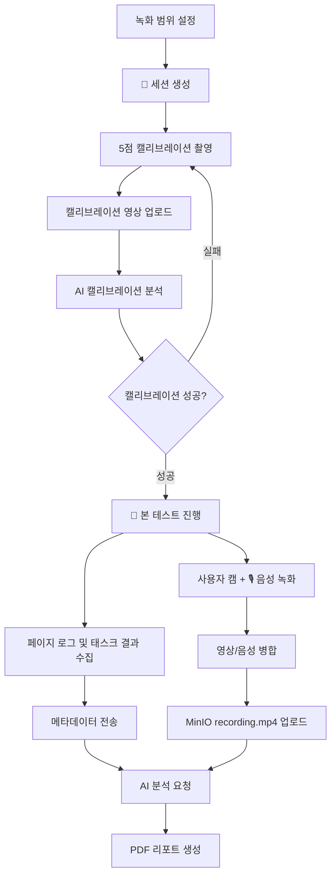

# 🎯 UT Automation Client

> **사용성 테스트 AI 자동화 프로젝트 - 클라이언트 파트**  
> PySide6 기반 데스크톱 앱으로 캘리브레이션, 사용자 캠 녹화, 음성 녹음, 테스트 로그 수집, 서버 업로드, AI 분석 요청까지 담당합니다.

사용자가 웹 테스트 시나리오를 수행하는 동안 클라이언트는 **캘리브레이션 영상**, **본 테스트 사용자 캠 영상**, **음성**, **페이지 이동 로그**, **태스크 수행 결과**를 수집하고 서버 API와 MinIO 업로드 흐름에 맞춰 전송합니다.

이 프로젝트에서 클라이언트 파트는 데스크톱 UI, 사용자 캠 녹화, 음성 녹음, 캘리브레이션 업로드, 테스트 메타데이터 전송, 분석 요청 트리거를 담당합니다.

## ✨ 주요 기능

- PySide6 기반 데스크톱 GUI
- 서버 URL 및 녹화/분석 세션 생성
- 5점 캘리브레이션 웹캠 영상 촬영
- 캘리브레이션 영상 MinIO 업로드 및 서버 분석 요청
- 본 테스트 사용자 캠 영상 녹화
- 마이크 음성 녹음 및 영상 파일 병합
- 테스트 페이지 이동 로그 및 스크린샷 업로드
- 태스크 성공/실패 및 수행 시간 기록
- 본 테스트 영상, 페이지 로그, 태스크 결과 서버 전송
- AI 분석 요청 후 PDF 리포트 확인 흐름 지원

## 🧰 기술 스택

| 구분 | 사용 기술 |
| --- | --- |
| Language | Python |
| GUI | PySide6, QtWebEngine |
| Camera | OpenCV |
| Audio | sounddevice, wave |
| Video Processing | OpenCV VideoWriter, imageio-ffmpeg |
| HTTP Client | requests |
| Storage Upload | MinIO Presigned URL |
| Async Worker | QThread, Signal/Slot |

## 📁 프로젝트 구조

```text
ut_client/
  main.py
  requirements.txt
  core/
    api_client.py         # 서버 API 및 MinIO 업로드 클라이언트
    recorder.py           # 본 테스트 사용자 캠 녹화 및 음성 녹음
  ui/
    main_window.py        # 전체 화면 흐름, 테스트 UI, 업로드/분석 UI
    calibration_dialog.py # 5점 캘리브레이션 촬영 다이얼로그
    overlay.py            # 녹화 영역 선택 오버레이
    widgets.py            # 공통 UI 위젯
    styles.py             # QSS 스타일
  utils/
    workers.py            # QThread 기반 업로드, 녹화, 분석 워커
  models/
    models.py             # 클라이언트 상태 및 데이터 모델
```

## 🧭 사용자 흐름



## 🔌 API 연동 요약

| 단계 | 메서드 | URL | 목적 |
| --- | --- | --- | --- |
| 세션 생성 | POST | `/api/v1/sessions` | viewport 정보와 함께 테스트 세션 생성 |
| 캘리브레이션 URL 요청 | POST | `/api/v1/sessions/{session_id}/calibrate/presigned-url` | 포인트별 영상 업로드 URL 발급 |
| 캘리브레이션 분석 | POST | `/api/v1/sessions/{session_id}/calibrate/start` | 5점 캘리브레이션 분석 시작 |
| 메타데이터 전송 | POST | `/api/v1/sessions/{session_id}/metadata` | 페이지 로그 및 태스크 결과 전송 |
| 본 영상 URL 요청 | POST | `/api/v1/sessions/{session_id}/presigned-url` | `recording.mp4` 업로드 URL 발급 |
| 본 분석 시작 | POST | `/api/v1/sessions/{session_id}/analyze` | 사용자 캠 영상, 음성, 로그 기반 분석 요청 |

## 🧩 핵심 구현

### 1. 👤 본 테스트 사용자 캠 녹화

본 테스트 영상은 웹페이지 화면이 아니라 AI 분석 대상인 사용자 얼굴 영상이어야 합니다. 따라서 `core/recorder.py`에서 화면 캡처 방식 대신 OpenCV 웹캠 프레임을 직접 녹화하도록 구성했습니다.

```python
cap = self._open_camera()

if not cap.isOpened():
    self.is_recording = False
    raise RuntimeError("웹캠을 열 수 없습니다. 다른 프로그램이 카메라를 사용 중인지 확인하세요.")

ret, frame = cap.read()
frame = cv2.resize(frame, (frame_width, frame_height))
self.writer.write(frame)
```

### 2. 🔄 녹화 프레임과 UI 프리뷰 동기화

오른쪽 사용자 캠 프리뷰가 실제 업로드 영상과 다르면 분석 결과를 검증하기 어렵습니다. 녹화 중인 프레임을 `preview_frame` 시그널로 UI에 그대로 전달하도록 만들었습니다.

```python
preview_frame = Signal(QImage)
...
self.preview_frame.emit(image)
```

```python
self.recorder.preview_frame.connect(self._on_camera_frame_ready)
```

### 3. 🎙️ 음성 녹음 및 MP4 병합

마이크 입력은 `sounddevice`로 받고, WAV 파일에 스트리밍 저장한 뒤 `imageio-ffmpeg`를 사용해 사용자 캠 영상과 병합합니다.

```python
with wave.open(wav_path, "wb") as wf:
    wf.setnchannels(self.AUDIO_CHANNELS)
    wf.setsampwidth(2)
    wf.setframerate(self.AUDIO_SAMPLE_RATE)
```

```python
cmd = [
    _FFMPEG_EXE, "-y",
    "-i", video_path,
    "-i", wav_path,
    "-c:v", "copy",
    "-c:a", "aac",
    "-b:a", "128k",
    "-shortest",
    merged_path,
]
```

### 4. ⚙️ 작업 분리와 UI 멈춤 방지

녹화, 업로드, 분석 상태 확인은 UI 스레드에서 직접 처리하지 않고 `QThread` 기반 worker로 분리했습니다.

```python
class RecordingWorker(QThread):
    error = Signal(str)

    def run(self):
        try:
            self.recorder.start(self.pixel_region, self.output_path)
        except Exception as exc:
            self.error.emit(str(exc))
```

## 🛠️ 문제 발생 및 해결 방법

| 문제 | 원인 | 해결 |
| --- | --- | --- |
| 본 테스트 영상이 페이지 화면으로 저장됨 | 기존 recorder가 화면 캡처 기반으로 동작 | OpenCV 웹캠 녹화 방식으로 전환 |
| 캘리브레이션 후 본 테스트 진입 시 앱이 튕김 | 캘리브레이션 직후 카메라 장치가 완전히 해제되기 전에 재오픈 | 카메라 리소스 명시 해제, 1.5초 지연 후 녹화 시작, 카메라 백엔드 순차 재시도 |
| 사용자 캠 프리뷰가 멈춤 | QCamera/QVideoWidget 프리뷰와 OpenCV 녹화가 카메라를 중복 사용 | 실제 녹화 프레임을 UI 프리뷰에 전달하는 방식으로 단일 소스화 |
| 말을 하면 사용자 캠이 멈춤 | 오디오 콜백에서 메모리 누적 및 웹캠 내장 마이크 충돌 가능성 | WAV 스트리밍 저장, high latency 설정, 웹캠 마이크가 아닌 입력 장치 우선 선택 |
| 오디오가 MP4에 포함되지 않음 | 시스템 ffmpeg 미설치 | `imageio-ffmpeg`의 ffmpeg 실행 파일을 자동 사용하도록 보강 |
| 녹화 실패 시 프로그램 강제종료 | QThread 내부 예외가 UI에서 처리되지 않음 | `RecordingWorker.error` 시그널로 예외 전달 및 메시지 박스 처리 |
| 캘리브레이션 실패 포인트 재촬영 필요 | AI 서버가 일부 포인트 실패 반환 | 실패 포인트만 필터링하여 재촬영 흐름 구성 |

## 🧱 안정성 개선 포인트

- 캘리브레이션 종료 시 `VideoCapture`, `VideoWriter`, `QTimer` 해제
- ⏱본 테스트 시작 전 카메라 장치 준비 시간 확보
- `CAP_ANY`, `CAP_MSMF`, `CAP_DSHOW` 순차 시도
- 오디오 데이터를 메모리에 누적하지 않고 WAV 파일로 즉시 저장
- 녹화 worker 예외를 UI에 안전하게 전달
- MinIO 업로드 실패 시 재시도 및 사용자 안내

## 🚀 실행 방법

```powershell
python -m pip install -r requirements.txt
python main.py
```

앱 실행 후 다음 순서로 테스트합니다.

1. Server URL 확인
2. 녹화 범위 설정 및 세션 생성
3. 5점 캘리브레이션 촬영
4. 캘리브레이션 업로드 및 분석 결과 대기
5. 본 테스트 진행
6. 사용자 캠 영상 및 🎙️ 음성 녹화
7. 테스트 종료 및 데이터 전송
8. 분석 리포트 확인

## 📌 요구사항

- Python 3.11 권장
- 웹캠
- 마이크
- 접근 가능한 Main Server
- MinIO Presigned URL 업로드 가능 환경

## 🏆 포트폴리오 관점에서의 담당 성과

- PySide6 기반 데스크톱 클라이언트 UI 설계 및 구현
- 서버 API 명세에 맞춘 세션, 캘리브레이션, 메타데이터, 분석 요청 흐름 구현
- OpenCV 기반 사용자 캠 녹화 파이프라인 구현
- sounddevice 기반 음성 녹음 및 ffmpeg 병합 처리
- MinIO Presigned URL 업로드 처리
- QThread 기반 비동기 작업 처리로 UI 응답성 확보
- 실제 테스트 중 발생한 카메라 충돌, 오디오 충돌, 영상 대상 불일치 문제를 단계적으로 원인 분석 및 개선

## 🔮 향후 개선 방향

- UI에서 마이크 입력 장치를 직접 선택하는 설정 화면 추가
- 녹화 전 카메라/마이크 상태 점검 기능 추가
- 업로드 실패 파일 로컬 큐 저장 및 재전송 기능 추가
- 분석 완료 알림 및 PDF 다운로드 상태 표시 개선
- 테스트 로그와 영상 타임스탬프 정합성 검증 자동화