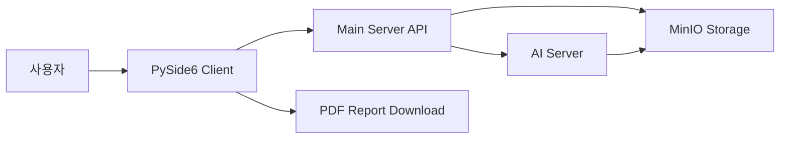
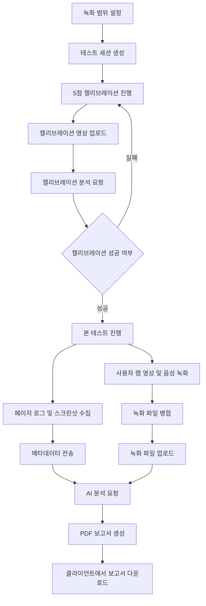

# 🎯 UT Automation Client

> 사용성 테스트 AI 자동화 프로젝트의 클라이언트 파트입니다.  
> PySide6 기반 데스크톱 앱에서 캘리브레이션, 웹 테스트 진행, 사용자 캠 녹화, 음성 녹음, 페이지 로그 수집, 스크린샷 업로드, AI 분석 요청, PDF 보고서 다운로드까지 담당합니다.

이 클라이언트는 사용자가 웹 페이지나 영상 콘텐츠를 탐색하는 동안 얼굴 영상, 음성, 페이지 이동 기록, 테스트 수행 결과를 수집하고 서버 API 및 MinIO 업로드 흐름에 맞춰 전송합니다. AI 서버는 전달된 사용자 캠 영상과 메타데이터를 기반으로 시선, 표정, 음성을 분석하고 최종 PDF 보고서를 생성합니다.

## 📌 프로젝트 개요

- 프로젝트명: UT Automation Client
- 담당 영역: 클라이언트 애플리케이션
- 핵심 목표: 사용성 테스트 데이터를 자동 수집하고 AI 분석 서버로 안정적으로 전달
- 주요 사용자: 사용성 테스트 진행자, 피험자, 프로젝트 평가자
- 개발 형태: Python 데스크톱 클라이언트

## ✅ 주요 기능

- PySide6 기반 사용성 테스트 GUI 제공
- 테스트 URL 입력 및 내장 브라우저 탐색
- 새 창 또는 새 탭 링크를 현재 테스트 브라우저 안에서 처리
- 5점 캘리브레이션 촬영 및 서버 업로드
- 캘리브레이션 포인트 표시 후 응시 시간 확보
- 본 테스트 중 사용자 웹캠 영상 녹화
- 본 테스트 중 마이크 음성 녹음 및 영상 파일 병합
- 페이지 이동 로그, 페이지별 스크린샷, 테스트 결과 수집
- 페이지별 스크린샷에 page_no를 포함하여 업로드
- 테스트 종료 후 메타데이터 전송 및 AI 분석 요청
- 서버 응답 기반 PDF 보고서 다운로드

## 🧰 기술 스택

| 구분 | 사용 기술 |
| --- | --- |
| Language | Python |
| GUI | PySide6, QtWebEngine |
| Browser | QWebEngineView |
| Camera | OpenCV |
| Audio | sounddevice, wave |
| Video Processing | OpenCV VideoWriter, imageio-ffmpeg |
| HTTP Client | requests |
| Storage Upload | MinIO Presigned URL |
| Async Worker | QThread, Signal/Slot |

## 🏗️ 시스템 아키텍처



## 🔄 사용자 흐름



## 📁 프로젝트 구조

```text
ut_client/
  main.py
  requirements.txt
  README.md
  core/
    api_client.py         # 서버 API, MinIO 업로드, 보고서 다운로드 처리
    recorder.py           # 사용자 캠 녹화, 음성 녹음, MP4 병합
  ui/
    main_window.py        # 메인 화면, 테스트 진행, 업로드, 보고서 UI
    calibration_dialog.py # 5점 캘리브레이션 촬영 다이얼로그
    overlay.py            # 녹화 범위 선택 오버레이
    widgets.py            # 공통 UI 위젯
    styles.py             # QSS 스타일
  utils/
    workers.py            # QThread 기반 녹화, 업로드, 스크린샷 worker
  models/
    models.py             # 클라이언트 상태 및 데이터 모델
```

## 🔌 API 연동

| 단계 | 메서드 | URL | 목적 |
| --- | --- | --- | --- |
| 세션 생성 | POST | `/api/v1/sessions` | 테스트 세션 생성 |
| 캘리브레이션 업로드 URL 요청 | POST | `/api/v1/sessions/{session_id}/calibrate/presigned-url` | 포인트별 캘리브레이션 영상 업로드 URL 발급 |
| 캘리브레이션 분석 요청 | POST | `/api/v1/sessions/{session_id}/calibrate/start` | 5점 캘리브레이션 분석 시작 |
| 스크린샷 업로드 URL 요청 | POST | `/api/v1/sessions/{session_id}/presigned-url` | 페이지별 스크린샷 업로드 URL 발급 |
| 메타데이터 전송 | POST | `/api/v1/sessions/{session_id}/metadata` | 페이지 로그, 테스트 결과, 스크린샷 정보 전송 |
| 본 테스트 영상 업로드 URL 요청 | POST | `/api/v1/sessions/{session_id}/presigned-url` | 사용자 캠 녹화 파일 업로드 URL 발급 |
| 분석 시작 | POST | `/api/v1/sessions/{session_id}/analyze` | 사용자 캠 영상, 음성, 로그 기반 분석 요청 |
| 보고서 조회 | GET | `/api/v1/sessions/{session_id}/report` | PDF 파일 또는 다운로드 URL 조회 |

## 🧩 핵심 구현

### 사용자 캠 중심 녹화

초기 구현에서는 화면 또는 페이지가 녹화되는 문제가 있었으나, AI 서버가 필요로 하는 데이터는 사용자 얼굴 영상이므로 본 테스트 녹화 대상을 웹캠으로 변경했습니다. `core/recorder.py`에서 OpenCV로 웹캠 프레임을 읽고, 같은 프레임을 UI 미리보기와 녹화 파일에 동시에 사용합니다.

```python
ret, frame = cap.read()
frame = cv2.resize(frame, (frame_width, frame_height))
self.writer.write(frame)
self.preview_frame.emit(image)
```

### 음성 녹음 및 영상 병합

테스트 중 음성 분석을 위해 `sounddevice`로 마이크 입력을 WAV 파일에 스트리밍 저장하고, 녹화 종료 후 `imageio-ffmpeg`가 제공하는 ffmpeg 실행 파일로 사용자 캠 영상과 음성을 하나의 MP4 파일로 병합합니다.

```python
with wave.open(wav_path, "wb") as wf:
    wf.setnchannels(self.AUDIO_CHANNELS)
    wf.setsampwidth(2)
    wf.setframerate(self.AUDIO_SAMPLE_RATE)
```

```python
cmd = [
    _FFMPEG_EXE, "-y",
    "-i", video_path,
    "-i", wav_path,
    "-c:v", "copy",
    "-c:a", "aac",
    "-b:a", "128k",
    "-shortest",
    merged_path,
]
```

### 캘리브레이션 안정화

AI 서버에서 모든 포인트의 gaze 값이 거의 동일하다는 피드백이 있었기 때문에 포인트 표시 직후 바로 녹화하지 않고, 사용자가 해당 포인트를 응시할 시간을 둔 뒤 녹화를 시작하도록 수정했습니다.

```python
FIXATION_DELAY_MS = 1500
RECORD_DURATION_MS = 2500
```

캘리브레이션 포인트는 좌상단, 우상단, 중앙, 좌하단, 우하단처럼 화면 구석과 중앙을 포함하도록 구성했습니다.

### 페이지별 스크린샷 수집

히트맵이 마지막 페이지 기준으로만 생성되는 문제를 줄이기 위해 페이지 이동 시점마다 `loadFinished` 이벤트 기준으로 스크린샷을 캡처하고, `page_no`를 포함해 서버로 업로드합니다. 전체 화면이 아닌 테스트 브라우저 영역을 우선 캡처하도록 조정했습니다.

### PDF 보고서 다운로드

MinIO에는 PDF가 생성되어 있지만 클라이언트에서 다운로드하지 못하는 문제가 있어 서버 응답에서 다양한 URL 키를 탐색하도록 보강했습니다. 서버가 PDF 바이너리를 직접 반환하는 경우와 presigned URL을 반환하는 경우를 모두 처리합니다.

## 🛠️ 문제 발생 및 해결 방법

| 문제 | 원인 | 해결 방법 |
| --- | --- | --- |
| 본 테스트 영상이 페이지 화면으로 저장됨 | 기존 녹화 대상이 화면 캡처 흐름에 가까웠음 | 본 테스트 녹화를 OpenCV 기반 사용자 웹캠 녹화로 변경 |
| 본 테스트 시작 시 사용자 캠이 멈춤 | UI 미리보기와 녹화 로직이 카메라를 중복 점유 | 녹화 프레임을 UI 미리보기에도 전달하는 단일 소스 방식으로 변경 |
| 말을 하면 사용자 캠이 멈춤 | 오디오 콜백 부하와 카메라 내장 마이크 충돌 가능성 | WAV 스트리밍 저장, high latency 설정, 비카메라 마이크 우선 선택 |
| 오디오가 녹화 파일에 포함되지 않음 | 시스템 ffmpeg 의존성 또는 병합 로직 부족 | imageio-ffmpeg 기반 자동 병합 처리 추가 |
| 캘리브레이션 gaze 값이 거의 동일함 | 포인트 표시 직후 녹화가 시작되어 응시 시간이 부족 | 포인트 표시 후 1.5초 대기, 이후 2.5초 녹화로 변경 |
| 캘리브레이션 후 본 테스트 진입 시 강제 종료 | 카메라 리소스 해제 타이밍과 재오픈 충돌 | 캘리브레이션 종료 시 리소스 명시 해제, 본 테스트 카메라 오픈 안정화 |
| 네이버 메뉴 클릭 시 반응 없음 | 새 창 또는 새 탭 요청을 QWebEngineView가 처리하지 못함 | `createWindow`를 재정의해 현재 테스트 브라우저에서 열리도록 처리 |
| 히트맵이 마지막 페이지 위주로 생성됨 | 스크린샷과 페이지 로그가 페이지별로 충분히 분리되지 않음 | 페이지 로드 완료 기준 캡처, page_no 포함 업로드, 업로드 완료 후 메타데이터 전송 |
| PDF가 MinIO에 있는데 다운로드 실패 | 서버 응답의 PDF URL 키 형식이 클라이언트 예상과 다름 | 여러 응답 키와 중첩 구조를 탐색하고 PDF 바이너리 응답도 처리 |
| TVING 같은 OTT 영상 재생 불가 | DRM, Widevine, 서비스 정책상 QtWebEngine 재생 제한 | 비DRM 영상 또는 테스트용 영상 페이지 사용 권장 |

## 🚀 실행 방법

```powershell
python -m pip install -r requirements.txt
python main.py
```

실행 후 기본 흐름은 다음과 같습니다.

1. Server URL을 확인합니다.
2. 녹화 범위를 설정하고 세션을 생성합니다.
3. 5점 캘리브레이션을 진행합니다.
4. 캘리브레이션 업로드와 분석 완료를 기다립니다.
5. 테스트 URL을 열고 본 테스트를 진행합니다.
6. 사용자 캠 영상, 음성, 페이지 로그, 스크린샷을 수집합니다.
7. 테스트 종료 후 데이터를 서버로 전송합니다.
8. AI 분석이 끝나면 PDF 보고서를 다운로드합니다.

## 📋 요구사항

- Python 3.11 권장
- 웹캠
- 마이크
- 접근 가능한 Main Server
- MinIO presigned URL 업로드 가능 환경
- AI 서버와 연동 가능한 세션 API

## 🏆 포트폴리오 성과

- PySide6 기반 데스크톱 테스트 클라이언트 UI 설계 및 구현
- QWebEngineView 기반 테스트 브라우저와 새 창 처리 구현
- OpenCV 기반 사용자 캠 녹화 파이프라인 구현
- sounddevice 기반 음성 녹음 및 ffmpeg 병합 처리 구현
- 5점 캘리브레이션 촬영 및 안정화 로직 구현
- MinIO presigned URL 기반 파일 업로드 구현
- 페이지별 스크린샷 및 로그 수집 흐름 개선
- AI 분석 요청 및 PDF 보고서 다운로드 흐름 구현
- 실제 테스트 중 발생한 카메라 멈춤, 오디오 누락, 히트맵 오류, 보고서 다운로드 실패 문제를 단계적으로 분석하고 해결

## 🔮 향후 개선 방향

- UI에서 마이크 입력 장치를 직접 선택하는 설정 화면 추가
- 녹화 전 카메라와 마이크 상태 자동 점검 기능 추가
- 업로드 실패 파일 로컬 큐 저장 및 재전송 기능 추가
- 분석 진행률과 보고서 생성 상태 표시 개선
- 테스트 로그와 영상 타임스탬프 정합성 자동 검증
- DRM 영상이 필요한 테스트의 경우 외부 브라우저 연동 방식 검토
