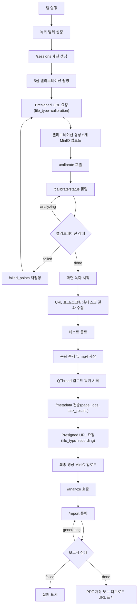

# 클라이언트 요구사항분석서 개정본 v6

대상 문서: `요구사항.pdf`, 기존 `클라이언트_요구사항분석서_및_순서도.md`  
반영 기준: `프로토타입_개발계획서_최종v6.txt`, API 명세 v6  
작성 목적: 기존 요구사항에서 변경된 캘리브레이션 주체, API, DB, 업로드 흐름, 타임스탬프 정책을 반영한다.

> 참고: `요구사항.pdf`는 Google Sheets를 PDF로 출력한 벡터/윤곽선 형태라 텍스트 추출이 되지 않았다. 따라서 기존 Markdown 요구사항서와 v6 개발계획서를 기준으로 개정본을 재작성했다.

---

## 1. 주요 수정 및 추가사항

| 구분 | 기존 요구사항 | 개정 요구사항 |
|---|---|---|
| 캘리브레이션 처리 주체 | 클라이언트가 MediaPipe로 gaze_x/gaze_y 추출 | 클라이언트는 5개 웹캠 영상 촬영·업로드만 담당, AI 서버가 MediaPipe로 홍채 좌표 추출 |
| 클라이언트 의존성 | MediaPipe 필요 | MediaPipe 제거, PySide6 / OpenCV / mss / requests 중심 |
| `/metadata` payload | calibrations + page_logs + task_results | page_logs + task_results만 전송 |
| 캘리브레이션 API | `/metadata`에 포함 | `/sessions/{id}/calibrate`, `/sessions/{id}/calibrate/status` 신규 사용 |
| page_logs | stay_sec 기반 | start_video_ts / end_video_ts 절대 타임스탬프 기반 |
| 원시 분석 데이터 저장 | frame_emotions, gaze_points DB 테이블 | MinIO JSON(detail_json_path)로 위임 |
| 히트맵 | 별도 경로 불명확 | page_summaries.heatmap_path로 PDF 생성 시 직접 참조 |
| 영상 업로드 | 동기 처리 가능성 | QThread 백그라운드 업로드, 업로드 중 종료 경고 |
| Presigned URL | 900초 | 3600초 |
| API 수 | 5개 | 7개 |

---

## 2. 클라이언트 범위

클라이언트는 UT 테스트 실행 중 필요한 사용자 조작, 화면 녹화, 웹캠 캘리브레이션 영상 촬영, 페이지 로그, 태스크 결과를 수집하고 메인 서버에 전송한다. AI 분석 자체는 클라이언트에서 수행하지 않는다.

클라이언트 주요 기능은 다음과 같다.

1. 녹화 범위 설정 UI
2. 5점 캘리브레이션 영상 촬영 및 업로드
3. 캘리브레이션 분석 상태 폴링
4. 지정 영역 화면 녹화
5. URL 이동 감지 및 페이지별 타임스탬프 기록
6. 페이지별 스크린샷 캡처 및 업로드
7. 태스크 완료/실패 및 소요시간 기록
8. 메타데이터 전송
9. 최종 녹화 영상 업로드
10. 분석 요청 및 보고서 상태 조회

---

## 3. 기능 요구사항

| ID | 구분 | 요구사항 | 상세 설명 | 수용 기준 |
|---|---|---|---|---|
| CL-REQ-01 | 실행 환경 | 클라이언트는 Windows 환경에서 실행되어야 한다. | Python 3.12 이상, Windows PC 기준으로 실행한다. | 앱이 Windows에서 정상 실행된다. |
| CL-REQ-02 | 실행 환경 | 클라이언트는 PySide6 기반 UI를 제공해야 한다. | PySide6, PySide6-WebEngine을 사용한다. | 메인 UI와 내장 브라우저가 정상 표시된다. |
| CL-REQ-03 | 실행 환경 | 웹캠 접근이 가능해야 한다. | 5점 캘리브레이션 영상을 촬영하기 위해 카메라 권한이 필요하다. | 웹캠 초기화 실패 시 오류와 재시도 안내가 표시된다. |
| CL-REQ-04 | 실행 환경 | 화면 캡처가 가능해야 한다. | 지정 영역 화면을 녹화하기 위해 화면 캡처 권한이 필요하다. | 지정 영역 영상 파일이 생성된다. |
| CL-REQ-05 | 좌표 체계 | viewport_region은 비율 좌표로 관리해야 한다. | x, y, w, h는 모두 0.0~1.0 범위로 저장한다. | 서버 전송 payload가 비율 좌표만 포함한다. |
| CL-REQ-06 | 녹화 범위 | 사용자는 녹화할 화면 영역을 직접 지정할 수 있어야 한다. | 투명 전체화면 오버레이에서 마우스 드래그로 영역을 선택한다. | 선택 영역이 QRect로 계산되고 비율 좌표로 변환된다. |
| CL-REQ-07 | 녹화 범위 | 선택 중인 영역은 실시간으로 시각화되어야 한다. | QPainter로 선택 박스와 배경 마스크를 표시한다. | 드래그 중 영역 경계가 즉시 갱신된다. |
| CL-REQ-08 | 세션 | 클라이언트는 녹화 범위 확정 후 세션을 생성해야 한다. | `/api/v1/sessions`로 viewport_region을 전송한다. | 응답으로 session_id를 받아 이후 API에 사용한다. |
| CL-REQ-09 | 캘리브레이션 | 클라이언트는 5점 캘리브레이션 UI를 제공해야 한다. | 화면에 기준점 5개를 순서대로 표시한다. | 5개 기준점이 모두 표시되고 진행 상태가 표시된다. |
| CL-REQ-10 | 캘리브레이션 | 각 기준점마다 웹캠 영상을 촬영해야 한다. | 기준점 응시 중 3~5초 분량의 mp4 영상을 저장한다. | `point_no`, `screen_x`, `screen_y`, `path`가 로컬에 기록된다. |
| CL-REQ-11 | 캘리브레이션 | 클라이언트는 MediaPipe를 사용하지 않아야 한다. | 홍채 좌표 추출은 AI 서버가 담당한다. | 클라이언트 requirements에 mediapipe가 없어야 한다. |
| CL-REQ-12 | 캘리브레이션 | 캘리브레이션 영상은 MinIO에 업로드해야 한다. | `file_type="calibration"`으로 Presigned URL을 발급받고 업로드한다. | 각 포인트별 `video_object_key`가 확보된다. |
| CL-REQ-13 | 캘리브레이션 | 캘리브레이션 영상 업로드 후 분석 등록 API를 호출해야 한다. | `/api/v1/sessions/{id}/calibrate`에 5개 point 정보를 전송한다. | 서버가 캘리브레이션 분석 작업을 큐에 등록한다. |
| CL-REQ-14 | 캘리브레이션 | 캘리브레이션 분석 상태를 폴링해야 한다. | `/api/v1/sessions/{id}/calibrate/status`를 1~2초 간격으로 조회한다. | done이면 테스트 진행, failed이면 failed_points 재촬영 안내를 표시한다. |
| CL-REQ-15 | 화면 녹화 | 지정 영역만 녹화해야 한다. | viewport_region을 실제 픽셀 좌표로 변환해 캡처한다. | 저장 영상이 사용자가 선택한 영역과 일치한다. |
| CL-REQ-16 | 화면 녹화 | 녹화 결과는 mp4 파일로 저장해야 한다. | OpenCV VideoWriter를 사용한다. | 테스트 종료 후 mp4 파일이 존재한다. |
| CL-REQ-17 | URL 로그 | URL 변경을 감지해야 한다. | QWebEngineView URL 변경 이벤트를 기반으로 페이지 로그를 생성한다. | URL 변경마다 page_no가 1씩 증가한다. |
| CL-REQ-18 | URL 로그 | 페이지별 진입/이탈 시각을 기록해야 한다. | 녹화 시작 시점을 0초로 하는 start_video_ts, end_video_ts를 기록한다. | stay_sec 대신 절대 타임스탬프가 전송된다. |
| CL-REQ-19 | 스크린샷 | 페이지 진입 시 스크린샷을 캡처해야 한다. | 현재 페이지 화면을 캡처해 이미지로 저장한다. | page_logs에 screenshot_path가 포함된다. |
| CL-REQ-20 | 스크린샷 | 스크린샷은 MinIO에 업로드해야 한다. | `file_type="screenshot"`으로 Presigned URL을 발급받는다. | 경로 형식은 `screenshots/session_{id}/page_{page_no}.png`를 권장한다. |
| CL-REQ-21 | 태스크 | 태스크 체크 UI를 제공해야 한다. | 사용자가 완료/실패를 수동 기록할 수 있어야 한다. | task_order, result, duration_sec가 생성된다. |
| CL-REQ-22 | 태스크 | 태스크 소요시간을 기록해야 한다. | 태스크 시작/종료 기준으로 duration_sec를 계산한다. | task_results에 소요시간이 포함된다. |
| CL-REQ-23 | 업로드 | 최종 녹화 영상은 Presigned URL로 업로드해야 한다. | `file_type="recording"`으로 URL을 발급받는다. | 영상 object_key가 서버/MinIO 기준으로 확보된다. |
| CL-REQ-24 | 업로드 | 영상 업로드는 백그라운드에서 수행되어야 한다. | QThread를 사용해 UI 블로킹을 방지한다. | 업로드 중에도 UI가 멈추지 않는다. |
| CL-REQ-25 | 업로드 | 업로드 중 앱 종료 시 경고해야 한다. | closeEvent에서 업로드 진행 여부를 확인한다. | 사용자가 취소하면 업로드를 계속한다. |
| CL-REQ-26 | 메타데이터 | `/metadata`에는 page_logs와 task_results만 포함해야 한다. | v6부터 calibrations는 `/metadata`에서 제거한다. | payload에 calibrations 항목이 없어야 한다. |
| CL-REQ-27 | 분석 요청 | 업로드 완료 후 `/analyze`를 호출해야 한다. | 최종 녹화 영상 업로드 완료 신호 후 분석 큐 등록을 요청한다. | 서버가 report status를 generating으로 전환한다. |
| CL-REQ-28 | 보고서 | 보고서 상태를 조회해야 한다. | `/api/v1/sessions/{id}/report`를 조회한다. | generating, done, failed 상태를 구분한다. |
| CL-REQ-29 | 보고서 | PDF 보고서를 저장하거나 다운로드 URL을 안내해야 한다. | 서버가 PDF bytes 또는 pdf_url을 반환할 수 있다. | done 상태에서 사용자가 보고서를 확인할 수 있다. |
| CL-REQ-30 | 오류 처리 | 네트워크/API 오류는 사용자에게 명확히 표시해야 한다. | 세션 생성, 업로드, 캘리브레이션, 분석, 보고서 단계별 오류를 처리한다. | 오류 발생 시 앱이 비정상 종료되지 않는다. |
| CL-REQ-31 | 재시도 | 업로드 실패 시 재시도할 수 있어야 한다. | Presigned URL을 재발급받고 재업로드한다. | 실패 후 동일 파일 재업로드가 가능하다. |
| CL-REQ-32 | 재촬영 | 캘리브레이션 실패 포인트만 재촬영할 수 있어야 한다. | 서버가 failed_points를 반환하면 해당 point_no만 다시 촬영한다. | 전체 5점을 반복하지 않고 실패 포인트만 보완 가능하다. |

---

## 4. API 요구사항

### 4.1 공통 규칙

| 항목 | 내용 |
|---|---|
| Base URL | `http://<server-ip>:8000` |
| API Prefix | `/api/v1` |
| 요청 형식 | JSON |
| 좌표 단위 | 0.0~1.0 비율 좌표 |
| Presigned URL 유효시간 | 3600초 |
| 파일 타입 | `calibration`, `recording`, `screenshot` |
| session_id | 문자열 UUID 또는 서버 정의 ID를 문자열로 보관 |

### 4.2 `POST /api/v1/sessions`

세션 생성 및 viewport_region 저장.

```json
{
  "viewport_region": {
    "x": 0.0,
    "y": 0.0,
    "w": 1.0,
    "h": 1.0
  }
}
```

응답:

```json
{
  "session_id": "uuid-string",
  "created_at": "2026-05-07T00:00:00Z"
}
```

### 4.3 `POST /api/v1/sessions/presigned-url`

MinIO 업로드용 URL 발급.

```json
{
  "session_id": "uuid-string",
  "file_type": "calibration",
  "point_no": 1
}
```

응답:

```json
{
  "presigned_url": "https://minio.example/...",
  "object_key": "calibrations/session_uuid/point_1.mp4",
  "expires_in": 3600
}
```

### 4.4 `POST /api/v1/sessions/{id}/calibrate`

캘리브레이션 영상 5개를 AI 서버 분석 큐에 등록.

```json
[
  {
    "point_no": 1,
    "screen_x": 0.1,
    "screen_y": 0.1,
    "video_object_key": "calibrations/session_uuid/point_1.mp4"
  }
]
```

응답:

```json
{
  "status": "analyzing"
}
```

### 4.5 `GET /api/v1/sessions/{id}/calibrate/status`

캘리브레이션 분석 상태 조회.

```json
{
  "status": "done",
  "failed_points": []
}
```

상태 값:

| status | 의미 | 클라이언트 처리 |
|---|---|---|
| analyzing | 분석 중 | 폴링 유지 |
| done | 완료 | 테스트 시작 |
| failed | 일부/전체 실패 | failed_points 재촬영 |

### 4.6 `POST /api/v1/sessions/{id}/metadata`

테스트 메타데이터 전송. v6부터 calibrations는 포함하지 않는다.

```json
{
  "page_logs": [
    {
      "page_no": 1,
      "url": "https://example.com",
      "start_video_ts": 0.0,
      "end_video_ts": 12.4,
      "screenshot_path": "screenshots/session_uuid/page_1.png"
    }
  ],
  "task_results": [
    {
      "task_order": 1,
      "result": "completed",
      "duration_sec": 45.3
    }
  ]
}
```

### 4.7 `POST /api/v1/sessions/{id}/analyze`

최종 녹화 영상 업로드 완료 후 분석 큐 등록.

```json
{}
```

응답:

```json
{
  "queued": true,
  "status": "generating"
}
```

### 4.8 `GET /api/v1/sessions/{id}/report`

보고서 상태 조회 또는 PDF 다운로드.

| 상태 | HTTP | 응답 |
|---|---:|---|
| generating | 202 | `{"status":"generating"}` |
| done | 200 | PDF bytes 또는 `pdf_url` |
| failed | 500 | `{"status":"failed","error":"..."}` |

---

## 5. DB 연관 요구사항

클라이언트는 DB에 직접 접근하지 않지만, 전송 데이터가 아래 테이블 구조와 맞아야 한다.

| 테이블 | 생성/저장 주체 | 클라이언트 관련 데이터 |
|---|---|---|
| sessions | 메인 서버 | viewport_region, video_path, status |
| calibrations | AI 서버 | screen_x/y는 클라이언트 전달, gaze_x/y는 AI 서버 추출 |
| page_logs | 메인 서버 | page_no, url, start_video_ts, end_video_ts, screenshot_path |
| task_results | 메인 서버 | task_order, result, duration_sec |
| stt_segments | AI 서버 | 클라이언트 직접 관련 없음 |
| page_summaries | AI 서버/메인 서버 | page_logs와 연결, heatmap_path 포함 |
| reports | 메인 서버 | report status 및 PDF 다운로드 |

v6 기준으로 제거/변경되는 항목:

- `frame_emotions` 테이블 제거
- `gaze_points` 테이블 제거
- `page_logs.stay_sec` 제거
- `/metadata.calibrations` 제거
- 클라이언트 측 `gaze_x`, `gaze_y` 추출 제거

---

## 6. 예외 처리 요구사항

| 상황 | 처리 방식 |
|---|---|
| 서버 연결 실패 | 단계별 오류 메시지 표시, 재시도 가능 |
| 세션 생성 실패 | 캘리브레이션 진입 차단 |
| 웹캠 초기화 실패 | 캘리브레이션 진행 차단, 장치 확인 안내 |
| 캘리브레이션 영상 저장 실패 | 해당 포인트 재촬영 |
| 캘리브레이션 업로드 실패 | Presigned URL 재발급 후 재시도 |
| 캘리브레이션 분석 실패 | failed_points 기준 재촬영 |
| 녹화 파일 없음 | 업로드 차단 및 오류 표시 |
| 최종 영상 업로드 실패 | 재업로드 버튼 제공 |
| 업로드 중 앱 종료 | 경고 팝업 표시 |
| `/metadata` 전송 실패 | 로컬 데이터 유지 후 재전송 |
| `/analyze` 실패 | 업로드 완료 여부와 metadata 전송 여부 확인 후 재시도 |
| 보고서 생성 실패 | failed 상태 표시 및 서버 로그 확인 안내 |

---

## 7. 처리 순서도



---

## 8. 개발 우선순위

| 우선순위 | 항목 | 이유 |
|---:|---|---|
| 1 | 세션 생성 및 viewport_region 전송 | 모든 데이터의 기준 |
| 2 | 캘리브레이션 영상 촬영/업로드 | v6 핵심 변경사항 |
| 3 | `/calibrate/status` 폴링 | 본 테스트 시작 조건 |
| 4 | 화면 녹화 mp4 저장 | 최종 분석 입력 |
| 5 | URL 로그와 절대 타임스탬프 | 페이지별 분석 기준 |
| 6 | 스크린샷 업로드 | 히트맵 배경 |
| 7 | 태스크 체크 UI | 혼란도 산출 요소 |
| 8 | QThread 업로드 | 사용성 및 안정성 |
| 9 | `/metadata` + `/analyze` 연동 | 서버 분석 큐 연결 |
| 10 | `/report` 처리 | 최종 산출물 확인 |

---

## 9. 완료 기준

아래 흐름이 end-to-end로 동작하면 클라이언트 요구사항은 충족된 것으로 본다.

1. 사용자가 녹화 범위를 선택한다.
2. 클라이언트가 viewport_region으로 세션을 생성한다.
3. 캘리브레이션 포인트 5개를 촬영한다.
4. 캘리브레이션 영상 5개를 MinIO에 업로드한다.
5. `/calibrate` 호출 후 `/calibrate/status`가 done이 될 때까지 폴링한다.
6. done 이후 화면 녹화를 시작한다.
7. 테스트 중 URL 로그, 스크린샷, 태스크 결과가 수집된다.
8. 테스트 종료 후 녹화 파일이 mp4로 저장된다.
9. 백그라운드 워커가 metadata 전송, 녹화 영상 업로드, `/analyze` 호출을 수행한다.
10. `/report` 조회 결과 done 시 PDF 또는 다운로드 URL을 제공한다.

